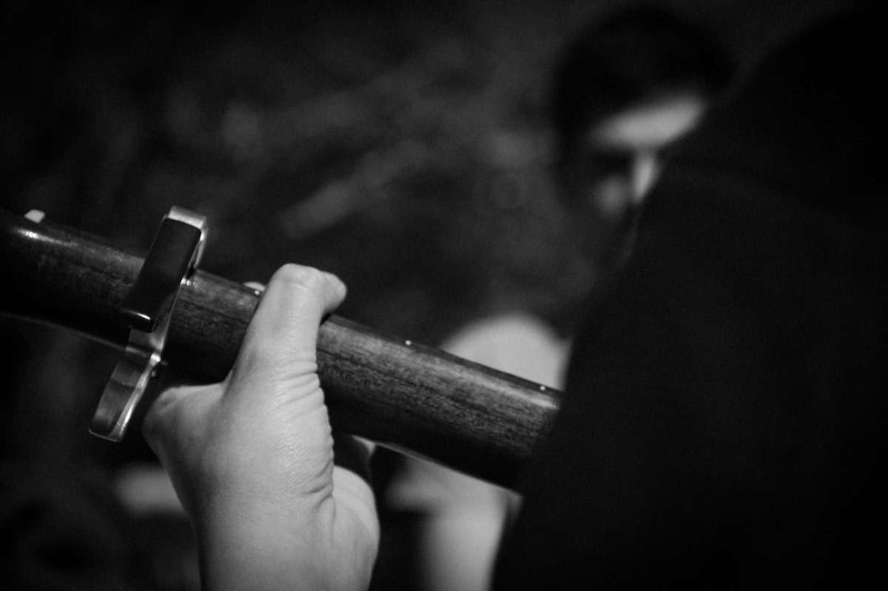

+++
title = "Naissance, vie et mort d'un groupe de rock"
date = 2026-05-17T18:00:00
tags = ["musique", "management"]
+++

Paris, un dimanche après-midi pluvieux. Je viens d'annoncer à ce qu'il reste de mon groupe de rock [Split Machine](https://youtu.be/tijoPmZZJ5o?si=aG83ooKHD_WXEOvp) que j'arrête.

Bien qu'en état de "mort cérébrale" depuis de nombreux mois, ce groupe représentait quelque chose d'important pour moi. Bien sûr, pour la plupart des gens, je suis arrivé à un âge où l'on devrait plutôt discuter de la marque de la montre que l'on porte au poignet que de celle de la basse qui pend à notre cou. Et c'est précisément pour cette raison que cette décision n'est pas si simple à intégrer, car elle soulève en moi un questionnement important, oserais-je existentiel : ai-je encore l'envie de faire de la musique ? En ai-je encore la force ? Et plus généralement, comment aborder cette dizaine critique qu'est la cinquantaine ?

# C'est quoi un groupe de rock ?

Cette question peut paraître un peu stupide. Tout le monde sait ce qu'est une groupe de rock : des gens qui se rassemblent et qui font de la musique avec des instruments amplifiés, une batterie et du chant. Souvent ils boivent des bières, fument des clopes (ou autre) et jouent trop fort. On va dire que ça c'est le résultat, le rendu d'un groupe, ce qui se voit de l'extérieur. 

Mais un groupe c'est aussi autre chose : c'est un système. Un système avec son fonctionnement propre, ses codes, ses rôles, ses problèmes humains et logistiques, ses prises de tête, ses moments de rire. Et parfois ses instants de grâce, quand la musique émerge, l'émotion, la symbiose, qu'une fois le morceau terminé on a l'impression d'avoir fait du sport ! Ces moments sont rares, il faut s'en souvenir. 

Depuis que je joue dans des groupes, j'ai rencontré trois organisations différentes :
- un leader et des gens qui jouent pour lui. 
- 