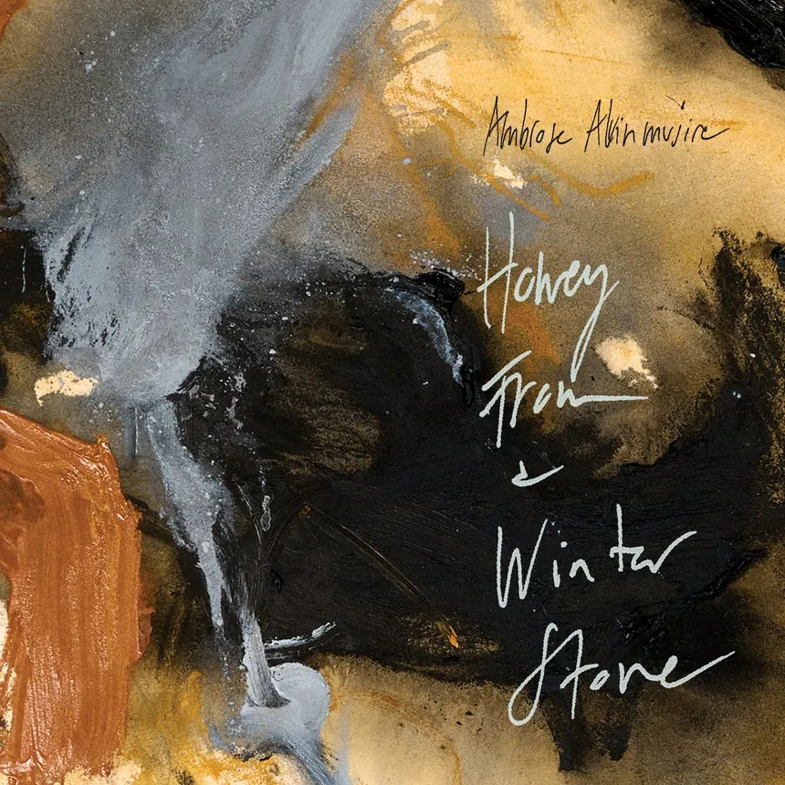

+++
title = "Découverte : Ambrose Akinmusire"
date = 2026-05-16T18:00:00
tags = ["musique"]
+++

J'ai découvert Ambrose Akinmusire en visionnant sur Youtube une *[vidéo de Flea](https://www.youtube.com/watch?v=eyzEBjc-6DA)* (le bassiste des RHCP, ai-je besoin de le préciser) dans laquelle il parle de quelques albums qui l'ont récemment inspirés. C'est toujours intéressant de voir à quel point cet artiste disons "main stream" a des goûts très éclectiques. C'est très probablment dû à sa formation de trompettiste, et de son goût pour le jazz.  

Le mélange des genres est intéressant : jazz (tendance free), rap (dans le style des Last Poets), quatuor à cordes, et bien sûr au centre sa trompette qui ne cherche pas à briller mais à raconter. Sur cet album *Honey from a Winter's Stone* sorti en 2025, Akinmusire pousse cette logique au bout — c'est dense, parfois exigeant, mais ça tient debout. A écouter donc. 

