+++
title = "Le 14e arrondissement de Paris"
date = 2026-08-02T18:00:00
tags = ["photo", "paris", "architecture"]
draft = false

+++

Quelques photos prises lors d'une promenade dans les rues du 14e arrondissement de Paris le dimanche 2 août 2026.
Appareil photo : Fuji X100-VI

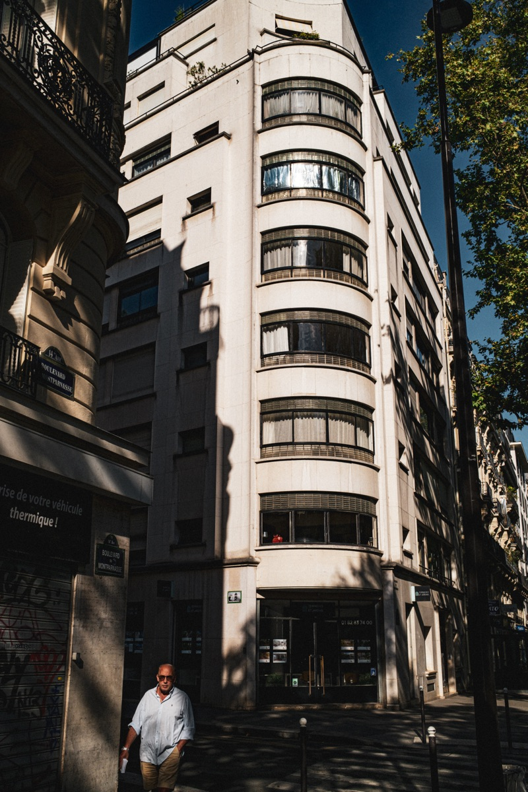

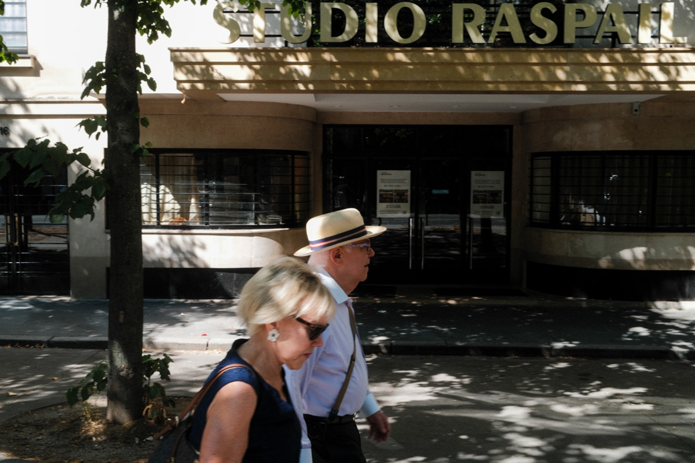

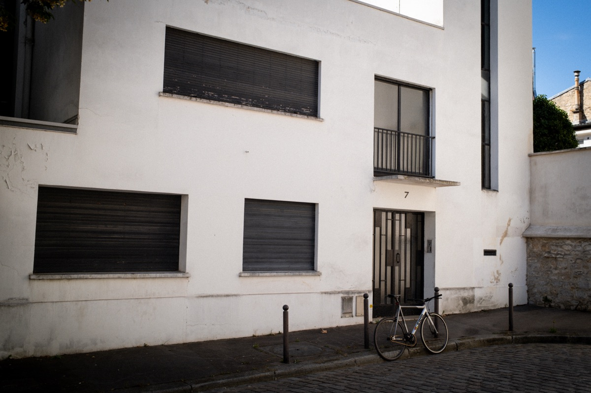

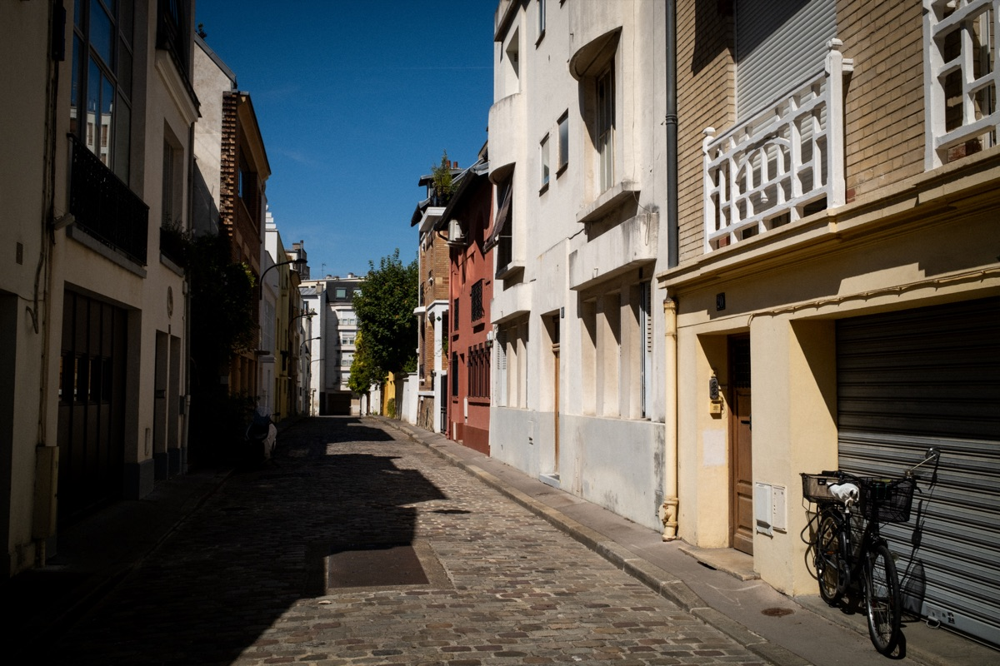

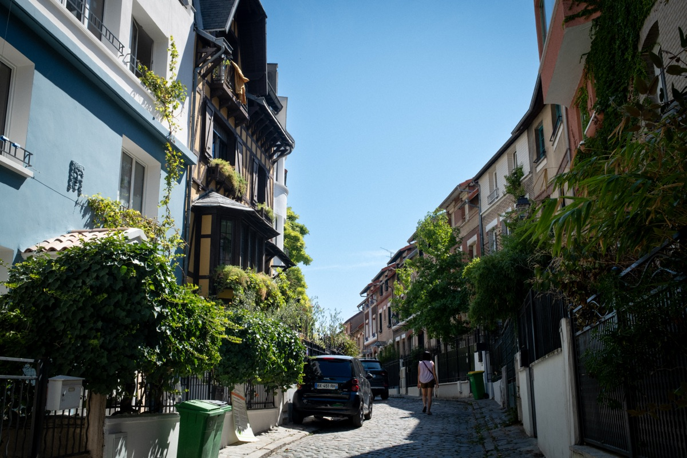

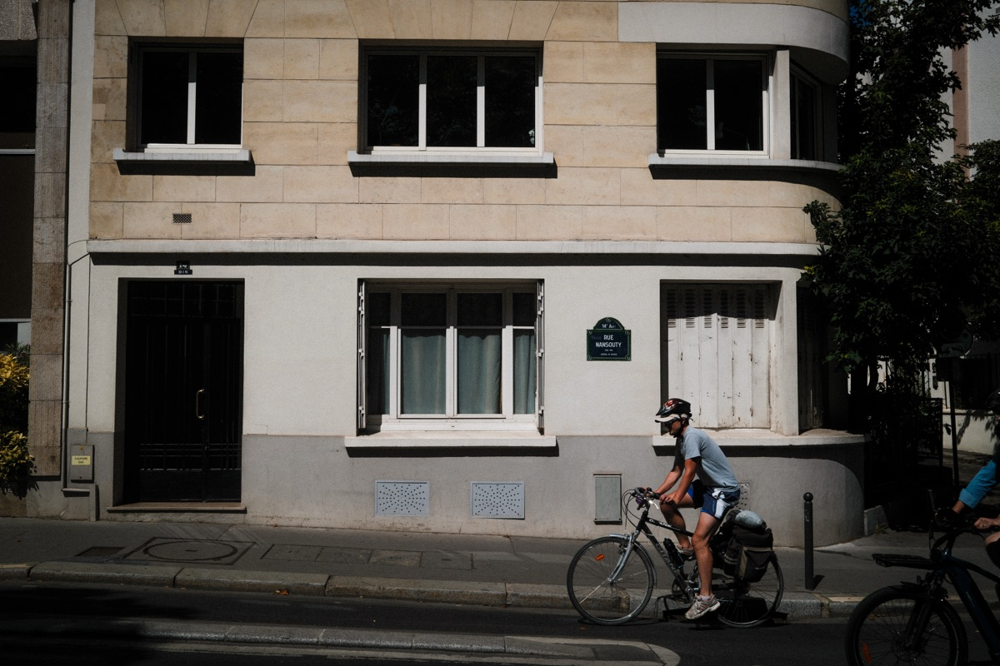

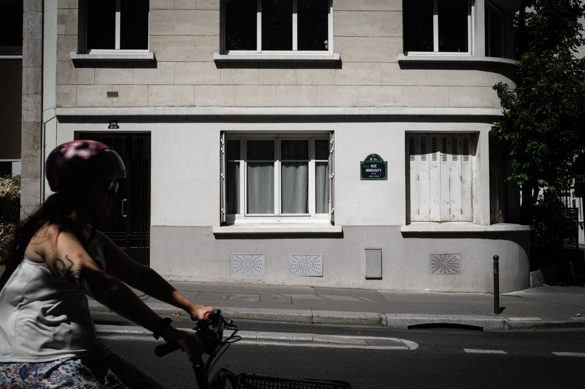

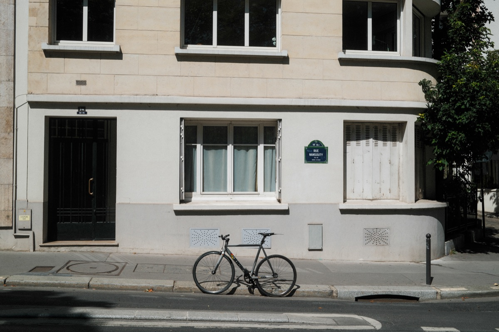

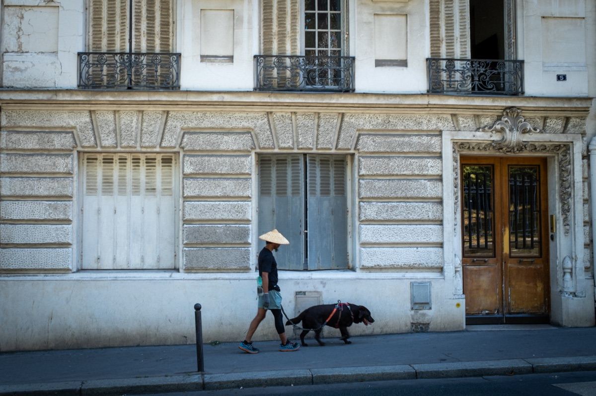

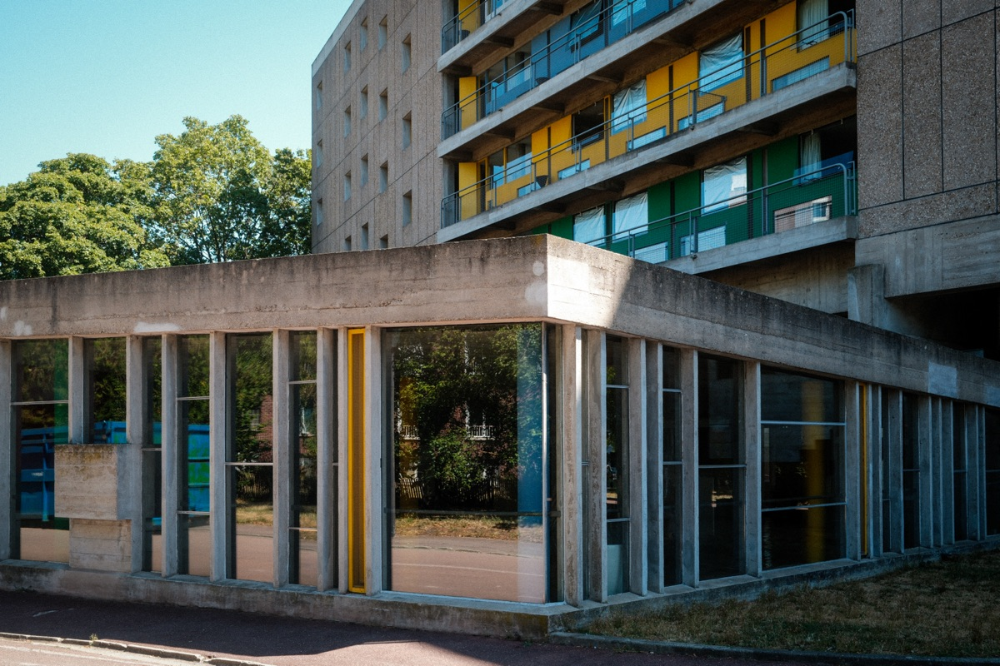

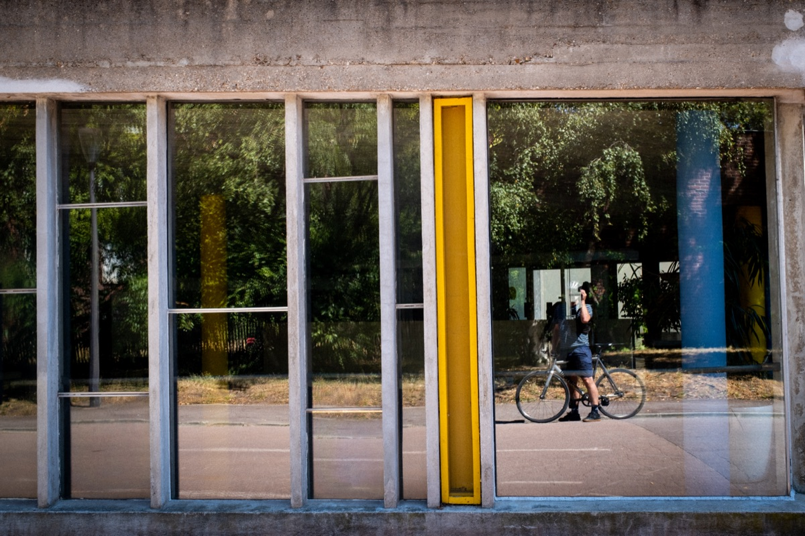